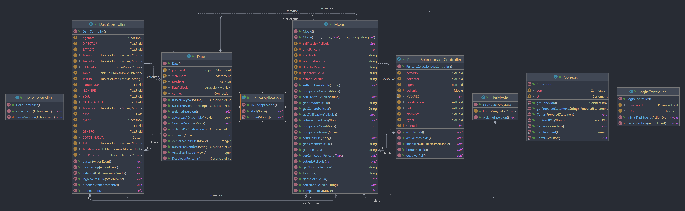

# Escuela Politécnica Nacional
## Estructura de Datos y Algoritmos II
**Developers**

|Autor|Support|
|-|-|
|Ricardo Becerra|Data Manager|
|Kevin Revelo|Backend and Componets Engineer|
|Santiago Salazar|Software Architect|
|Jeremy Torres|Frontend Developer|

Diseño del sistema 


Para mantener un desarrollo óptimo se propuso la inclusión de varias herramientas para la construcción del Software. 
### Entorno en contenedor.
El uso de contenedores se desarrolló con la intensión de trabajar con una base de datos común, que no se afecte por una versión distinta ni por un entorno fuera del esperado, algunos factores que se previno es el uso de `distintos puertos`  por lo que se enstableció el trabajo com el puerto `13306:3306`.

Otro factor es el `uso de distintas bases de datos` debido a que no es óptimo trabajar con bases individuales, por tal motivo usamos una base remota de las que nos conectamos con una **Red Privada virtual**

Para el desarrollo del proyecto se optó por el uso del lenguaje `JAVA` con el que se propuso trabajar con programación orientada a objetos, bajo el apoyo a este paradigma establecimos la codigicación del siente diagrama de clases:


Para la implementación de este sistema se propuso el uso de INTELLIJ IDEA para la codificación, y como se optó por desarrollar una interfaz para facvilitar el uso del sofrtware por parte del usuario se usó `JAVAFX` como herramienta para el desarrollo de la base de datos. Para la construcción de la base de datos se usó la herramienta desarrolada por Oracle **Scene Builder** 

## Algoritmos de Búsqueda y Ordenamiento
Se usó algoritmos específicos para la implementación:
### Insertion Sort
```java
public void ordenarInsercion(){
        for (int i = 1; i < this.listaPelicula.size(); i++) {
            Movie PeliculaActual = this.listaPelicula.get(i);
            int j = i - 1;
            while (j >= 0 && this.listaPelicula.get(j).getNombrePelicula().compareToIgnoreCase(PeliculaActual.getNombrePelicula()) > 0) {
                this.listaPelicula.set(j + 1, this.listaPelicula.get(j));
                j = j - 1;
            }
            this.listaPelicula.set(j + 1, PeliculaActual);
        }
    }
```
### Búsqueda Binaria
```java
    public ObservableList busquedaBinaria(String peli)
    {
        ArrayList<Movie>pelis=listaPelicula;
        ArrayList<Movie>searched=new ArrayList<Movie>();
        int     left = 0,
                right = pelis.size()-1;
        while (left<=right) {
            int middle = left + (right - left) / 2;
            if ( pelis.get(middle).getNombrePelicula().compareToIgnoreCase(peli)==0)
            {  searched.add(pelis.get(middle));
                return FXCollections.observableArrayList(searched);}
            if (pelis.get(middle).getNombrePelicula().compareToIgnoreCase(peli) < 0)
                left = middle + 1;
            else
                right = middle - 1;
        }
        return FXCollections.observableArrayList();
    }
```


  
 